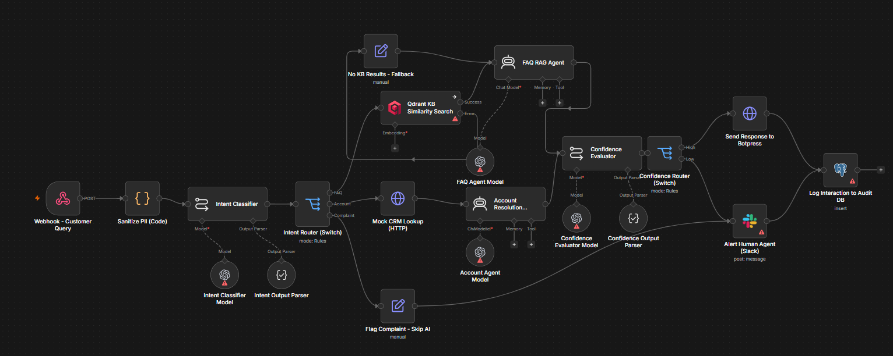

# AI Customer Support Resolution Engine

An AI powered customer support workflow built with n8n that classifies customer requests, retrieves relevant knowledge, resolves account related queries, escalates complaints, evaluates AI responses, and sends uncertain cases to human support.

## Overview

Customer support teams handle a large number of repetitive questions and account related requests every day.

This project demonstrates an automated support resolution pipeline that can:

• Understand the customer's request
• Classify the request by intent
• Retrieve relevant information from a knowledge base
• Generate grounded FAQ responses
• Resolve account related requests using CRM data
• Escalate complaints directly to human support
• Evaluate AI generated responses before delivery
• Log interactions for auditing and review

The workflow is designed as a portfolio project demonstrating how AI agents, retrieval systems, workflow automation, human review, and business system integrations can work together.

## Problem

Traditional customer support workflows often require agents to manually handle repetitive requests such as:

• Frequently asked questions
• Account related questions
• Password and access issues
• Billing and policy questions
• Customer complaints
• Requests that require escalation

This can increase response time and consume support team resources.

The goal of this project is to automate suitable requests while keeping human support involved when the AI should not respond automatically.

## Solution

The workflow receives a customer query through a webhook and processes it through several stages.

Customer Query
↓
PII Sanitization
↓
Intent Classification
↓
Intent Routing
↓
FAQ Retrieval or Account Resolution
↓
AI Response Generation
↓
Confidence Evaluation
↓
Automatic Response or Human Review
↓
Audit Logging

Complaints are routed directly to human support instead of being answered automatically by the AI.

## Architecture

### Main Components

**1. Customer Query Webhook**

Receives customer support requests through an n8n webhook.

Example endpoint:

`POST /customer-support-query`

Expected information includes a customer identifier and customer message.

**2. PII Sanitization**

The workflow processes the incoming message and masks detected personally identifiable information before sending the sanitized message to AI components.

The workflow records whether PII was detected and masked.

**3. Intent Classification**

An OpenAI powered classifier categorizes each request into one of three supported intents:

• FAQ
• Account
• Complaint

The classifier uses structured output validation to keep the result within the supported categories.

**4. Intent Routing**

The classified request is routed to the appropriate processing branch.

FAQ requests go to knowledge retrieval.

Account requests go to the CRM resolution flow.

Complaint requests go directly to human escalation.

**5. Knowledge Retrieval**

FAQ requests are processed through Qdrant vector search.

The workflow uses the `support_kb_articles` collection to retrieve relevant support information.

The retrieved context is passed to the FAQ agent so that the generated response can be grounded in available support documentation.

**6. FAQ RAG Agent**

The FAQ agent generates a response using the customer's sanitized message and retrieved knowledge.

The agent is instructed not to fabricate information beyond the available context.

The current implementation uses OpenAI `gpt 4o mini`.

**7. Account Resolution**

Account related requests are sent to a mock CRM endpoint.

The CRM response is provided to an account resolution agent together with the customer's sanitized request.

This demonstrates how an AI workflow could combine customer information from a business system with natural language reasoning.

The current CRM endpoint is a mock demonstration endpoint and is not connected to a real production CRM.

**8. Complaint Escalation**

Complaint requests bypass the AI response generation stage.

The workflow marks the request for human review and sends an escalation notification to the support team through Slack.

**9. Confidence Evaluation**

Responses generated by the FAQ and account resolution agents are evaluated by a separate AI confidence evaluator.

The evaluator checks factors such as:

• Factual accuracy
• Hallucination risk
• Policy alignment

The evaluator returns a categorical confidence result:

• High
• Low

This is a qualitative AI evaluation, not a calibrated probability score.

**10. Human Review**

Low confidence responses are routed to human support through Slack.

Complaint requests are also escalated directly.

This creates a human in the loop mechanism instead of allowing every request to be answered automatically.

**11. Audit Logging**

Processed interactions are logged to PostgreSQL.

The audit record can include:

• Customer identifier
• Intent
• Confidence result
• Resolution status
• AI response
• Creation timestamp

This provides a foundation for monitoring and reviewing automated support interactions.

## Example Scenarios

### FAQ Request

Customer:

`How long does the password reset link remain valid?`

Expected flow:

Customer Query
↓
PII Sanitization
↓
FAQ Classification
↓
Qdrant Knowledge Retrieval
↓
FAQ RAG Agent
↓
Confidence Evaluation
↓
Response or Human Review

Example response:

`The password reset link expires after 30 minutes.`

### Account Request

Customer:

`My account is locked. What should I do?`

Expected flow:

Customer Query
↓
PII Sanitization
↓
Account Classification
↓
CRM Lookup
↓
Account Resolution Agent
↓
Confidence Evaluation
↓
Response or Human Review

### Complaint

Customer:

`I want to complain about my order.`

Expected flow:

Customer Query
↓
PII Sanitization
↓
Complaint Classification
↓
Human Escalation
↓
Slack Notification
↓
Audit Logging

The workflow intentionally avoids generating an automated AI response for complaints.

## Knowledge Base

The main resolution workflow uses Qdrant for semantic knowledge retrieval.

The current demonstration knowledge base contains support articles covering example topics such as:

• Password reset
• Refund policy
• Locked accounts
• Shipping policy

The Qdrant collection expected by the workflow is:

`support_kb_articles`

Knowledge base ingestion is maintained separately from the main resolution workflow and is not included as a GitHub workflow artifact in this project version.

## Technology Stack

| Technology         | Purpose                                                           |
| ------------------ | ----------------------------------------------------------------- |
| n8n                | Workflow automation                                               |
| OpenAI GPT 4o mini | Intent classification, response generation, confidence evaluation |
| Qdrant             | Vector search and knowledge retrieval                             |
| PostgreSQL         | Audit logging                                                     |
| Slack              | Human escalation                                                  |
| HTTP APIs          | CRM and support system integration                                |
| LangChain nodes    | AI workflow orchestration and structured processing               |

## Human In The Loop

Human review is an important part of the architecture.

The workflow does not assume that every AI generated response should be sent directly to the customer.

Human escalation occurs when:

• The customer submits a complaint
• The AI confidence evaluation returns Low
• A response requires additional support team review

This approach provides a controlled automation model where AI handles suitable requests while humans remain responsible for uncertain or sensitive cases.

## Security Considerations

This project is a demonstration system and should not be treated as production ready.

Important production considerations include:

• Secure webhook authentication
• API authentication and authorization
• Proper secret management
• Stronger PII detection and protection
• Input validation
• Rate limiting
• API timeout and retry handling
• Structured error handling
• Database access controls
• Audit log protection
• Monitoring and alerting
• Human review policies
• Production CRM and support system authentication

The `.env.example` file contains variable names only and does not contain real credentials.

## Current Limitations

The current portfolio implementation has several intentional limitations.

• The CRM integration uses a mock endpoint
• The Botpress response endpoint is a mock endpoint
• The knowledge base contains demonstration content
• The supported intent categories are limited to FAQ, Account, and Complaint
• Confidence evaluation is qualitative rather than statistically calibrated
• PII masking uses pattern based detection and is not a complete privacy solution
• Production authentication and security controls are not fully implemented
• Automated knowledge base ingestion is maintained separately and is not included in the GitHub workflow artifact
• Error handling and retry policies require further production hardening

These limitations are documented intentionally so the project accurately represents the current implementation.

## Project Status

**Status: Portfolio project**

The main customer support resolution workflow is implemented in n8n and documented with its workflow JSON, architecture image, configuration template, and example inputs and outputs.

The project demonstrates the core automation and AI architecture while identifying the additional work required for production deployment.

## Planned Improvements

Future improvements may include:

• Automated knowledge base ingestion
• Improved document chunking
• Dedicated embedding generation
• Better retrieval evaluation
• More detailed intent classification
• Production CRM integration
• Production support platform integration
• Stronger authentication
• Retry and error handling
• Monitoring and observability
• Evaluation datasets and automated testing
• Calibrated confidence scoring
• Human review dashboard
• Expanded audit and analytics capabilities

## My Role

I designed and built the workflow architecture, AI routing logic, retrieval flow, response evaluation process, human escalation logic, and audit logging structure.

The project demonstrates practical experience with:

• AI agents
• LLM workflows
• RAG systems
• n8n automation
• API integrations
• Vector databases
• Human in the loop systems
• Structured AI outputs
• Workflow based decision making
• AI response evaluation

## License

This project is available under the license included in this repository.

