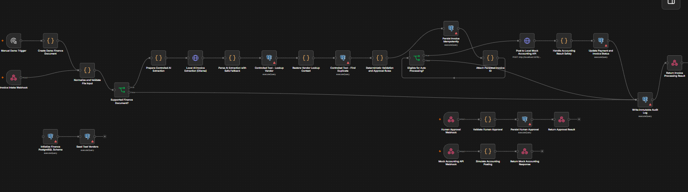

# AI Finance Operations Agent




An AI powered finance operations workflow that automates invoice intake, data extraction, validation, duplicate detection, approval routing, accounting submission, payment status updates, and audit logging.

Built as a practical AI automation project using workflow orchestration, structured data processing, business rules, and human approval steps.

---

## Overview

Finance teams often spend significant time processing invoices manually.

A typical invoice may need to be received, reviewed, entered into a system, checked for errors, compared against existing invoices, approved by the appropriate person, submitted to accounting, and tracked until payment.

This project demonstrates how an AI powered workflow can connect these steps into a single automated process.

The system is designed around a simple principle:

> Automate repetitive finance operations while keeping important business decisions under human control.

---

## Problem

Manual invoice processing can create several operational problems:

• Repetitive data entry
• Slow invoice processing
• Inconsistent validation
• Duplicate invoices
• Missed information
• Delayed approvals
• Poor visibility into invoice status
• Difficult audit tracking
• Too much time spent on routine finance operations

The goal of this project is to reduce repetitive manual work while maintaining validation, traceability, and human oversight.

---

## Solution

The AI Finance Operations Agent processes an invoice through a structured workflow.

### High Level Flow

```text
Invoice Received
       ↓
Invoice Data Extraction
       ↓
Data Validation
       ↓
Duplicate Detection
       ↓
Business Rules
       ↓
Approval Routing
       ↓
Human Approval
       ↓
Accounting Submission
       ↓
Payment Status Update
       ↓
Audit Log
```

Each stage has a defined purpose and passes structured information to the next stage.

---

## Core Capabilities

### 1. Invoice Intake

The workflow receives invoice information and begins the processing pipeline.

The incoming invoice can contain information such as:

```text
Vendor
Invoice Number
Invoice Date
Due Date
Currency
Subtotal
Tax
Total Amount
Payment Terms
Line Items
```

The workflow converts the incoming information into a structured format that can be processed consistently.

---

### 2. AI Data Extraction

The AI layer can extract relevant information from invoice content and return structured data.

Example:

```json
{
  "vendor": "Example Supplier Ltd",
  "invoice_number": "INV-1042",
  "invoice_date": "2026-09-15",
  "due_date": "2026-10-15",
  "currency": "USD",
  "subtotal": 1200,
  "tax": 216,
  "total": 1416
}
```

Structured extraction makes the information easier to validate and pass between workflow steps.

---

### 3. Invoice Validation

Extracted invoice information is checked before the invoice moves forward.

Validation can include:

• Required field checks
• Invoice number checks
• Amount validation
• Date validation
• Currency checks
• Vendor information checks
• Missing data detection
• Business rule validation

Invalid or incomplete invoices can be stopped instead of being automatically processed.

---

### 4. Duplicate Invoice Detection

Duplicate invoices are an important finance operations problem.

The workflow checks invoice information against existing records to identify potential duplicates.

Useful comparison fields can include:

```text
Vendor
Invoice Number
Invoice Amount
Invoice Date
```

If an invoice appears to be a duplicate, the workflow can flag it for review rather than allowing it to continue automatically.

---

### 5. Approval Routing

Invoices can be routed according to defined business rules.

For example:

```text
Invoice Amount
      ↓
Business Rules
      ↓
Approval Requirement
```

Different thresholds can require different levels of approval.

This allows the workflow to separate routine invoices from invoices that require additional review.

---

### 6. Human Approval

The system does not treat every decision as an AI decision.

Important actions can be routed to a human reviewer before the invoice continues.

Example:

```text
Invoice
   ↓
Validation
   ↓
Duplicate Check
   ↓
Approval Required
   ↓
Human Review
   ↓
Approved / Rejected
```

This creates a human in the loop for decisions that may have financial consequences.

---

### 7. Accounting Submission

Once an invoice passes the required checks and approval process, the workflow can prepare the invoice for accounting submission.

The structured invoice data can then be passed to the appropriate accounting or financial system through an API or integration layer.

---

### 8. Payment Status Updates

After accounting submission, the workflow can track the invoice through later stages of its lifecycle.

Example status flow:

```text
Received
   ↓
Processing
   ↓
Validated
   ↓
Pending Approval
   ↓
Approved
   ↓
Submitted
   ↓
Paid
```

This provides a clearer view of where an invoice currently stands.

---

### 9. Audit Logging

Important workflow events can be recorded for traceability.

Example:

```text
Invoice Received
Invoice Extracted
Validation Completed
Duplicate Check Completed
Approval Requested
Approval Completed
Accounting Submission Completed
Payment Status Updated
```

An audit trail helps teams understand what happened to an invoice and when each step occurred.

---

# Workflow Architecture

```text
                    ┌──────────────────┐
                    │  Invoice Input   │
                    └────────┬─────────┘
                             │
                             ▼
                    ┌──────────────────┐
                    │  Data Extraction │
                    │       + AI       │
                    └────────┬─────────┘
                             │
                             ▼
                    ┌──────────────────┐
                    │    Validation    │
                    └────────┬─────────┘
                             │
                             ▼
                    ┌──────────────────┐
                    │ Duplicate Check  │
                    └────────┬─────────┘
                             │
                             ▼
                    ┌──────────────────┐
                    │ Business Rules   │
                    └────────┬─────────┘
                             │
                             ▼
                    ┌──────────────────┐
                    │ Approval Routing │
                    └────────┬─────────┘
                             │
                       Human Review
                             │
                             ▼
                    ┌──────────────────┐
                    │ Accounting / ERP │
                    └────────┬─────────┘
                             │
                             ▼
                    ┌──────────────────┐
                    │ Payment Tracking │
                    └────────┬─────────┘
                             │
                             ▼
                    ┌──────────────────┐
                    │   Audit Log      │
                    └──────────────────┘
```

---

# Example Workflow

Consider an invoice received from a supplier.

### Step 1

The invoice enters the workflow.

### Step 2

The AI extracts the relevant invoice information.

### Step 3

The extracted information is converted into structured fields.

### Step 4

The workflow validates the required information.

### Step 5

The invoice is checked for possible duplication.

### Step 6

Business rules determine whether approval is required.

### Step 7

If approval is required, the invoice is routed to the appropriate reviewer.

### Step 8

After approval, the invoice proceeds toward accounting submission.

### Step 9

The invoice status is updated as it moves through the process.

### Step 10

Important events are recorded for auditability.

---

# AI Layer

The AI component is used where unstructured information needs to be interpreted and converted into structured information.

The workflow separates AI based processing from deterministic business rules.

### AI is useful for:

• Extracting information from unstructured invoice content
• Interpreting invoice fields
• Producing structured output
• Handling variations in invoice formats

### Deterministic logic is used for:

• Required field validation
• Duplicate checks
• Amount comparisons
• Approval thresholds
• Status transitions
• Workflow routing

This separation makes the workflow easier to understand, test, and maintain.

---

# Human in the Loop

Financial workflows should not depend entirely on autonomous AI decisions.

This project therefore supports human review at important stages.

A simplified model is:

```text
AI Processing
     ↓
Rule Validation
     ↓
Risk / Exception Detection
     ↓
Human Decision
     ↓
Continue Workflow
```

This approach helps prevent an automated workflow from blindly processing questionable invoices.

---

# Error Handling

The workflow is designed to stop or redirect invoices when required information or validation conditions are not satisfied.

Potential exception cases include:

```text
Missing invoice information
Invalid invoice data
Possible duplicate invoice
Failed validation
Approval rejection
Integration failure
Unexpected workflow error
```

Instead of silently continuing, an exception can be routed for review or further processing.

---

# Security Considerations

Finance workflows can process sensitive business information.

A production implementation should therefore consider:

• Secure API credentials
• Environment variables for secrets
• Access control
• Encryption in transit
• Encryption at rest
• Audit logging
• Data retention policies
• Role based approval access
• Secure handling of financial information

No real financial or confidential business data should be committed to this repository.

---

# Tech Stack

### Workflow Automation

**n8n**

Used to orchestrate the different stages of the finance workflow.

### AI

Large language model based processing is used for invoice information extraction and structured interpretation.

### APIs

API based integrations can connect the workflow with external business systems.

### Data Processing

Structured JSON data is passed between workflow stages.

### Repository

**GitHub**

Used for source control, documentation, and portfolio presentation.

---

# Example Structured Invoice Object

```json
{
  "vendor": "Example Supplier Ltd",
  "invoice_number": "INV-1042",
  "invoice_date": "2026-09-15",
  "due_date": "2026-10-15",
  "currency": "USD",
  "subtotal": 1200,
  "tax": 216,
  "total": 1416,
  "status": "pending_approval"
}
```

The exact fields can be adapted according to the requirements of the accounting system being integrated.

---

# Why This Project Matters

This project demonstrates more than simply connecting an AI model to an automation platform.

It demonstrates how AI can be combined with:

```text
AI
+
Workflow Automation
+
Business Rules
+
Data Validation
+
Human Approval
+
API Integrations
+
Auditability
```

The result is a workflow designed around an actual business process rather than a standalone AI demonstration.

---

# Key Design Principles

### Automation First

Automate repetitive operations wherever rules are clear.

### Human Oversight

Keep humans involved where financial decisions require review.

### Structured Data

Convert unstructured information into predictable fields before processing.

### Validation Before Action

Validate information before allowing downstream actions.

### Traceability

Record important workflow events so the process can be reviewed later.

### Modular Workflow

Keep individual stages separated so they can be modified or replaced without rebuilding the entire system.

---

# Portfolio Value

This project demonstrates practical experience with:

• AI workflow automation
• n8n
• LLM integration
• Structured data extraction
• Business process automation
• API based workflows
• Conditional logic
• Human in the loop systems
• Exception handling
• Finance operations workflows
• Audit logging
• AI agent architecture

---

# Project Status

**Status:** Completed prototype

The current project demonstrates the core finance operations workflow and its processing logic.

The architecture can be extended with production accounting systems, databases, authentication, notification systems, and additional approval rules.

---

# Future Improvements

Potential production improvements include:

• OCR based invoice ingestion
• PDF invoice processing
• Email based invoice intake
• Accounting software integrations
• ERP integrations
• Database backed invoice storage
• Vendor verification
• Advanced fraud detection
• Approval notifications
• Slack or Microsoft Teams approval workflows
• Finance dashboards
• Role based access control
• Detailed audit database
• Automated reconciliation
• Confidence scoring for AI extraction
• Human review queues
• Monitoring and alerting

---

# Example Production Architecture

```text
                    Invoice Email / Upload
                              │
                              ▼
                       Document Storage
                              │
                              ▼
                          OCR / AI
                              │
                              ▼
                    Structured Invoice Data
                              │
                              ▼
                         Validation
                              │
                              ▼
                      Duplicate Detection
                              │
                              ▼
                       Business Rules
                              │
                    ┌─────────┴─────────┐
                    │                   │
                    ▼                   ▼
              Auto Process        Human Review
                    │                   │
                    └─────────┬─────────┘
                              ▼
                       Accounting System
                              │
                              ▼
                       Payment Tracking
                              │
                              ▼
                         Audit Database
```

---

# Limitations

This repository represents a portfolio prototype rather than a complete enterprise finance platform.

Production deployment would require additional security controls, authentication, data storage, monitoring, access management, testing, and integration work.

AI generated information should also be validated before it is used for financial actions.

---

# Learning Outcomes

Building this project provided practical experience in designing AI workflows around a real business process.

Key areas include:

1. Designing multi step automation workflows
2. Combining AI processing with deterministic logic
3. Structuring data between workflow stages
4. Handling validation and exceptions
5. Designing human approval points
6. Thinking about auditability
7. Connecting AI systems to business operations
8. Designing workflows that can be extended into production systems

---

# Author

**Yasir Hassan**

3rd Year MBBS Student | AI Automation Developer

I build AI systems, automation workflows, chatbots, AI agents, and API driven business solutions using tools such as n8n and modern AI platforms.

My work focuses on the intersection of:

```text
Healthcare
AI
Automation
Software
```

## Connect

GitHub: [@yasirhassan970-coder](https://github.com/yasirhassan970-coder)

---

## Disclaimer

This project is provided for educational, demonstration, and portfolio purposes.

It is not intended to provide financial advice or replace professional accounting controls.

For production use, financial workflows should be reviewed, tested, secured, and approved by qualified finance and technology professionals.
